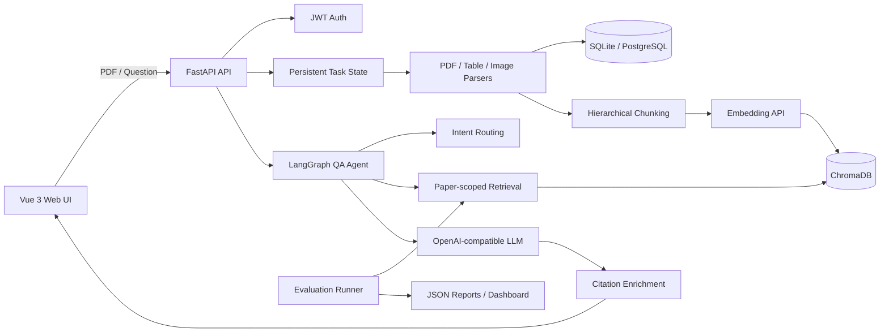

# PaperAI

PaperAI 是一个面向学术论文的可追溯 AI Agent。用户上传 PDF 后，系统会解析论文结构与图表、构建论文级知识库，并提供结构化摘要、深度解读和带原文定位的多轮问答。

这个项目不只关注“生成一个看起来合理的回答”，还重点解决三个问题：

- 回答依据来自哪里：引用关联到检索片段、章节和 PDF 物理页码。
- 如何证明优化有效：提供 Gold 数据集、检索/引用指标、回归报告和静态评测面板。
- 长任务失败怎么办：上传任务持久化状态，进程重启后可恢复尚未完成的正文处理。

## 核心能力

- PDF 流式上传、文件头校验与大小限制
- 中英文论文结构、正文、表格和图片解析
- 分层文本分块、前置内容补充索引与 ChromaDB 检索
- 基于 LangGraph 的意图识别、路由和回答生成
- 多会话论文问答与上下文记忆
- 回答引用、PDF 页码定位和原文高亮
- 结构化摘要、概念解释、方法对比和关键结论提取
- Gold/Silver/Draft 评测数据集、检索评测、端到端评分和静态面板
- systemd + Nginx 部署及 Docker Compose 配置

## 系统架构



### 论文处理流程

1. 分块写入 PDF，校验扩展名、`%PDF-` 文件头和文件大小。
2. 提取正文并调用论文解析 Agent 识别标题、作者、摘要和章节。
3. 将正文按章节分层切分，同时补充容易被章节解析遗漏的摘要、引言等前置页。
4. 保存论文与章节，构建论文隔离的向量知识库。
5. 正文可用后立即将任务标记为 `ready`，表格和图片继续后台增强。
6. 任务状态原子写入本地文件；服务重启时恢复 `pending/processing` 任务，最多重试两次。

### 问答 Agent 流程

1. 规则与 LLM 共同识别 metadata、method、experiment、comparison 等意图。
2. 对明确表号的问题优先精确检索表格，其余问题执行向量检索和轻量重排。
3. 将检索片段编号为 `S1...Sn`，要求模型只引用已提供的来源。
4. 引用结果补充章节、PDF 页码、块类型和精确搜索文本。
5. 前端点击引用后定位 PDF 页码并高亮原文。

`intent_confidence` 只表示意图分类是否明确；`evidence_confidence` 表示回答被检索证据直接支持的程度。二者都不等同于“答案准确率”。

复杂问题会按规则开启模型 thinking，但普通“机制/原理是什么”类抽取题不会仅因关键词触发 thinking，避免把简单证据归纳题拖成超时请求。

## 评测体系

评测集覆盖 5 篇中英文论文，包括长短文本、方法、实验、对比、跨章节和表格问题。当前数据包含 29 条样本：19 条人工核对的 Gold、7 条 Silver、3 条 Draft；其中 test split 有 12 条 verified Gold。

### 检索结果

| 运行 | 样本 | Hit@5 | Evidence Recall@5 | Precision@5 | MRR |
| --- | ---: | ---: | ---: | ---: | ---: |
| Dev 当前 | 7 | 71.43% | 71.43% | 22.86% | 0.5000 |
| Test 修复后回归 | 12 | 91.67% | 87.50% | 21.67% | 0.7500 |

历史封闭测试失败样本已经用于定位和修复索引缺陷，因此当前 test 结果是修复后回归结果，不能冒充新的无偏测试结果。

### 端到端回答与引用

| 指标 | 结果 |
| --- | ---: |
| 有效回答率 | 100.00% |
| 生成超时率 | 0.00% |
| 要点覆盖代理 | 67.50% |
| 引用原文支持率 | 100.00% |
| Gold 证据覆盖率 | 87.50% |
| 页码一致率 | 100.00% |
| 过度拒答率 | 0.00% |
| 无证据数字率 | 33.33% |
| 关键幻觉率 | 41.67% |
| P50 端到端延迟 | 11.34 s |
| P95 端到端延迟 | 14.61 s |

端到端质量指标只在有效回答上计算；生成失败或超时会单独计入 `valid_answer_rate` / `timeout_rate`。当前还没有 verified 不可回答样本，因此 `abstention_accuracy` 暂无统计值。“要点覆盖代理”和“关键幻觉率”都是确定性规则指标，不等同于语义正确率。完整评测说明见 [`backend/evals/README.md`](backend/evals/README.md)，可视化结果见 `backend/evals/reports/dashboard.html`。

## 可靠性与安全设计

- JWT 密钥在生产模式下必须至少 32 字符，默认关闭 DEBUG。
- CORS 使用显式允许列表，任务状态只能由任务所有者查询。
- 长密码不再被截断，注册密码限制为 8～128 字符。
- LLM 调用设置硬超时、SDK 重试、request ID 和 token 元数据日志。
- 日志不记录 API Key 或完整模型回答。
- 系统消息将论文、检索片段和上传内容声明为不可信数据，降低 Prompt 注入风险。
- 后台协程统一登记，异常可见，关机时统一取消。
- 任务 JSON 使用同目录临时文件和原子替换，避免进程中断产生半写文件。

## 技术栈

前端：Vue 3、TypeScript、Vite、Arco Design Vue、PDF.js、Axios、Markdown-it。

后端：FastAPI、SQLAlchemy Async、LangGraph、LangChain、ChromaDB、PyMuPDF、pdfplumber。

基础设施：SQLite（本地）、PostgreSQL（容器配置）、Nginx、systemd、Docker Compose。

模型层使用 OpenAI-compatible API，目前支持 Qwen 和 DeepSeek 配置。

## 目录结构

```text
.
├── backend/
│   ├── app/
│   │   ├── agent/              # 论文解析、摘要、问答 LangGraph
│   │   ├── api/                # 鉴权、论文、分析、会话 API
│   │   ├── llm/                # 模型客户端、超时和调用日志
│   │   ├── models/             # SQLAlchemy 模型
│   │   ├── parsers/            # PDF、表格、图片解析
│   │   ├── rag/                # 分块、检索、向量知识库
│   │   ├── services/           # PDF 文件与索引服务
│   │   └── utils/              # 后台任务与状态管理
│   ├── evals/                  # 数据集、指标、Runner、面板生成器
│   ├── scripts/                # 索引修复与维护脚本
│   └── tests/                  # 后端测试
├── frontend/
│   ├── src/components/         # 品牌外壳、PDF 阅读器等组件
│   ├── src/views/              # 首页、论文列表、阅读器、登录注册
│   └── nginx.conf              # 前端容器静态服务配置
├── deploy/nginx/               # 宿主机 Nginx 配置
├── docs/                       # 架构、API、开发和风险文档
├── docker-compose.yml
├── paperai-backend.service
└── paperai-frontend.service
```

## 本地开发

### 环境要求

- Python 3.10+
- Node.js 20+
- npm
- 可用的 OpenAI-compatible Chat 与 Embedding API

### 配置环境变量

```bash
cp .env.example .env
```

至少填写：

```dotenv
SECRET_KEY=replace-with-at-least-32-characters
LLM_PROVIDER=qwen
OPENAI_API_KEY=your-key
OPENAI_BASE_URL=https://dashscope.aliyuncs.com/compatible-mode/v1
OPENAI_MODEL=qwen-plus
EMBEDDING_MODEL=text-embedding-v3
```

真实密钥只保存在 `.env`，不要提交到 Git。

### 启动后端

```bash
python3 -m venv .venv
.venv/bin/pip install -r backend/requirements.txt
cd backend
../.venv/bin/python -m uvicorn app.main:app --host 0.0.0.0 --port 8000 --reload
```

### 启动前端

```bash
cd frontend
npm ci
npm run dev
```

开发地址：

- Web：`http://localhost:5173`
- API：`http://localhost:8000`
- OpenAPI：`http://localhost:8000/docs`

## 测试与构建

```bash
cd backend
PYTHONPATH=. ../.venv/bin/pytest -q
```

```bash
cd frontend
npm run build
```

建议提交前至少运行后端测试和前端生产构建；评测相关核心测试已经覆盖数据集校验、检索指标、端到端评分、dashboard 和审核工具。

## 运行评测

校验数据集：

```bash
cd backend
PYTHONPATH=. ../.venv/bin/python -m evals.validate_dataset \
  --dataset evals/datasets/paperqa_v1.jsonl
```

执行检索评测：

```bash
PYTHONPATH=. ../.venv/bin/python -m evals.run_retrieval_eval \
  --dataset evals/datasets/paperqa_v1.jsonl \
  --split test \
  --top-k 5
```

采集端到端回答：

```bash
PYTHONPATH=. ../.venv/bin/python -m evals.run_e2e_eval \
  --dataset evals/datasets/paperqa_v1.jsonl \
  --split test \
  --output evals/reports/e2e_test_raw.json \
  --resume
```

评分端到端结果：

```bash
PYTHONPATH=. ../.venv/bin/python -m evals.score_e2e_eval \
  --input evals/reports/e2e_test_raw.json \
  --output evals/reports/e2e_test_scored.json
```

重新生成静态面板：

```bash
PYTHONPATH=. ../.venv/bin/python -m evals.build_dashboard \
  --reports-dir evals/reports \
  --dataset evals/datasets/paperqa_v1.jsonl \
  --output evals/reports/dashboard.html
```

## 生产部署

### systemd + Nginx

前端由 Vite 构建，systemd 将 `dist` 发布到 `/var/www/paperai`，Nginx负责 HTTPS、静态资源和 `/api/` 反向代理。线上不使用 `vite preview`。

```bash
sudo install -d -o "$USER" -g www-data -m 0755 /var/www/paperai
sudo cp paperai-backend.service paperai-frontend.service /etc/systemd/system/
sudo cp deploy/nginx/paper.dongli.icu.conf /etc/nginx/sites-available/paper.dongli.icu.conf
sudo systemctl daemon-reload
sudo systemctl enable --now paperai-backend paperai-frontend
sudo nginx -t && sudo systemctl reload nginx
```

仓库中的 Nginx 配置引用 `paper.dongli.icu` 的 Let's Encrypt 证书；部署其他域名时需要替换域名和证书路径。

### Docker Compose

仓库提供前后端 Dockerfile 和 Compose 配置：

```bash
SECRET_KEY='replace-with-at-least-32-characters' docker compose up -d --build
```

Docker 配置尚未在当前云主机实际构建验证，使用前应先在具备 Docker 的环境执行 `docker compose config` 和完整构建。

## 主要 API

| 方法 | 路径 | 用途 |
| --- | --- | --- |
| POST | `/api/auth/register` | 注册 |
| POST | `/api/auth/login` | 登录 |
| GET | `/api/v1/papers/` | 论文列表 |
| POST | `/api/v1/papers/upload` | 上传并创建处理任务 |
| GET | `/api/v1/papers/tasks/{task_id}` | 查询处理进度 |
| GET | `/api/v1/papers/{paper_id}/pdf` | Range PDF 流 |
| POST | `/api/v1/papers/{paper_id}/qa` | 单轮论文问答 |
| POST | `/api/v1/chat/sessions/{session_id}/ask` | 多轮会话问答 |
| POST | `/api/v1/papers/{paper_id}/summarize` | 结构化摘要 |
| POST | `/api/v1/papers/{paper_id}/interpret` | 深度解读 |

当前不提供笔记功能，`/api/v1/notes` 不再挂载到 FastAPI 应用。

## 已知边界

- 评测集规模较小，结果只证明当前语料上的行为，不能代表任意学术 PDF 的通用准确率。
- 当前 Gold 数据集中还没有不可回答样本，拒答准确率需要补充 verified unanswerable 后才能正式衡量。
- 引用支持度已有离线评分和运行时置信度，但尚未对每条无依据引用执行强制拒绝。
- 后台任务是单机 MVP：本地原子状态 + 进程内协程，不支持多实例竞争消费。
- 暂未接入 Alembic、自动 CI、集中式 tracing、限流和供应商级熔断。
- OCR 质量、扫描 PDF、复杂跨页表格仍会影响解析与检索效果。
- `papers.py` 已拆出文件、索引和分析模块，但核心多媒体处理流水线仍然较长。

## 设计取舍与下一步

PaperAI 当前优先保持 Python 单体，因为 PDF/LLM/RAG 生态成熟，而且端到端延迟主要来自模型、Embedding 和文档解析，不是 FastAPI 路由的 CPU 性能。

下一步优先级：

1. 为测试和前端构建增加 CI 质量门禁。
2. 增加不可回答、Prompt 注入和恶意问题评测样本。
3. 在返回前执行逐条引用核验，对无依据事实降级或拒答。
4. 使用 Alembic 管理数据库迁移。
5. 当压测证明上传网关、文件流或并发调度成为瓶颈时，再考虑将该边界服务拆为 Go，而不是为了技术栈数量提前引入微服务复杂度。

## 进一步文档

- [`docs/ARCHITECTURE.md`](docs/ARCHITECTURE.md)
- [`docs/API.md`](docs/API.md)
- [`docs/DEV_NOTES.md`](docs/DEV_NOTES.md)
- [`docs/SMOKE_TESTS.md`](docs/SMOKE_TESTS.md)
- [`docs/TODO_OR_RISKS.md`](docs/TODO_OR_RISKS.md)
