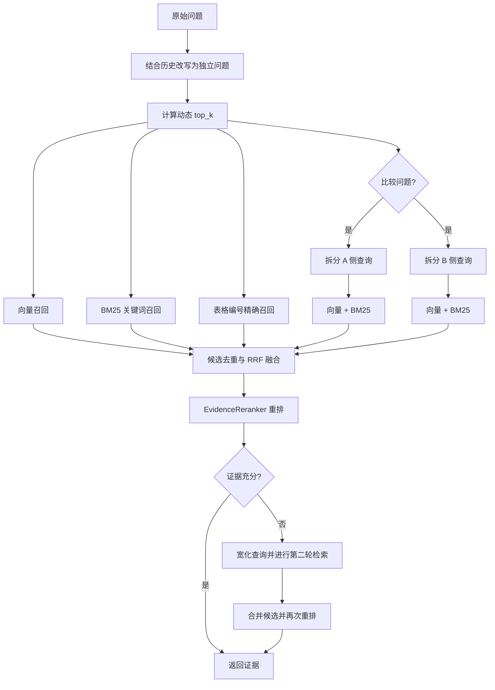

# PaperAI 混合检索流程

问答工作流中的 `retrieve_evidence` 节点统一调用
`HybridPaperRetriever`，不再固定执行单路 `top_k=5` 向量检索。

## 动态召回数量

- 短且简单的问题：4 个片段。
- 普通问题：6 个片段。
- 比较、多证据和跨章节问题：10 个片段。

## 实现原则

- 历史问题改写采用规则消解“这个、上述、它”等指代，不增加一次
  LLM 请求延迟。
- BM25 基于论文 `sections` 内容生成段落候选，补足专有名词、模型名、
  数据集名和精确数字的召回。
- 向量与关键词结果使用 reciprocal rank fusion 合并，再由独立
  `EvidenceReranker` 根据查询覆盖率、精确匹配和来源类型重排。
- 比较问题分别检索两侧证据，最后统一去重和重排。
- 候选过少、相关性过低，或比较问题缺少跨章节覆盖时，自动执行第二轮
  宽化检索。
