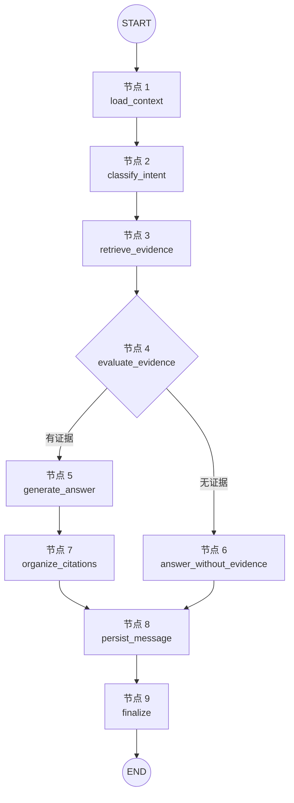

# 统一论文问答工作流

> **注意**: 当前默认问答路径已切换至 agent 路径（`harness/agents/lead_agent.py` 的 `stream_lead_agent`），
> 支持 ReAct loop、意图分析、多意图分解和深度控制。下文描述的 `UnifiedQAWorkflow` 作为 fallback 保留
> （通过 `paper_analysis.py` 的 `mode=workflow` 触发）。工具函数（引用构建、意图检测、置信度计算）
> 已提取至 `app/utils/qa_helpers.py`，供新旧路径共用。

同步问答、流式问答和论文分析兼容入口共用
`UnifiedQAWorkflow`。节点通过共享的 `QAWorkflowState` 传递数据，通过统一事件协议向
SSE、Redis 任务层和普通 HTTP 接口输出状态。

下图只展示 `UnifiedQAWorkflow` 中实际注册的节点。`START` 和 `END` 是图边界，
不是业务节点；数据库、Redis 和后台追问不混入节点图。

节点之外的 Redis 状态保存和后台追问由 Worker 事件消费者负责，不属于当前
`UnifiedQAWorkflow` 的注册节点。

## 统一事件

- `status`：节点阶段和用户可读状态。
- `reasoning_delta`：深度思考增量。
- `reasoning_done`：思考结束。
- `answer_delta`：最终回答增量。
- `citations`：根据回答中实际使用的 `[S1]` 等标记生成的确定性引用。
- `done`：消息 ID、意图、证据支持度和实际节点轨迹。
- `error`：发生错误的节点及对应的具体提示。

## 数据职责

- `QAWorkflowState`：单次执行期间的共享节点状态。
- Redis：24 小时内的流式任务状态、刷新恢复和防重复锁。
- PostgreSQL：完成后的正式问答消息和引用。
- Chroma：论文片段向量检索。

## 条件路由

`evaluate_evidence` 是当前条件节点：

- 有证据时进入 `generate_answer`。
- 无证据时进入 `answer_without_evidence`，不调用模型。

后续的查询改写、混合检索、二次检索和引用校验应继续作为独立节点加入，不再在 API
路由中复制业务流程。
