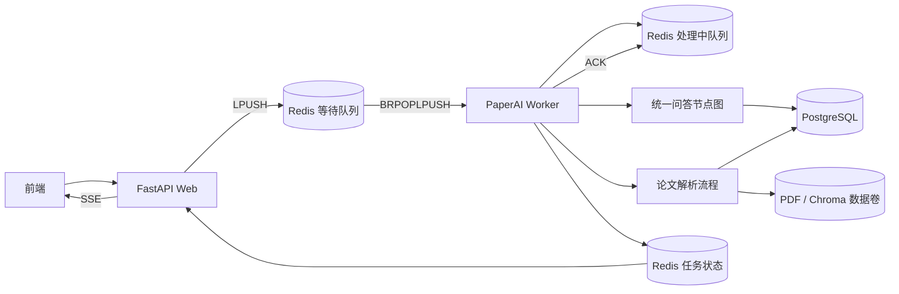

# 独立任务 Worker

Web API 不再直接执行论文解析或模型回答。任务进入 Redis 可靠队列，由独立
`paperai-worker` 容器执行。

## 可靠性规则

- 入队使用 Redis 等待队列。
- Worker 领取任务时原子移动到处理中队列。
- 成功后 ACK，从处理中队列删除。
- 失败最多重试两次，之后进入失败队列。
- Worker 启动时回收上次未 ACK 的处理中任务。
- Worker 每两秒更新带 TTL 的心跳，`/health` 可显示 Worker 状态。
- 回答停止通过 Redis 取消键通知 Worker。
